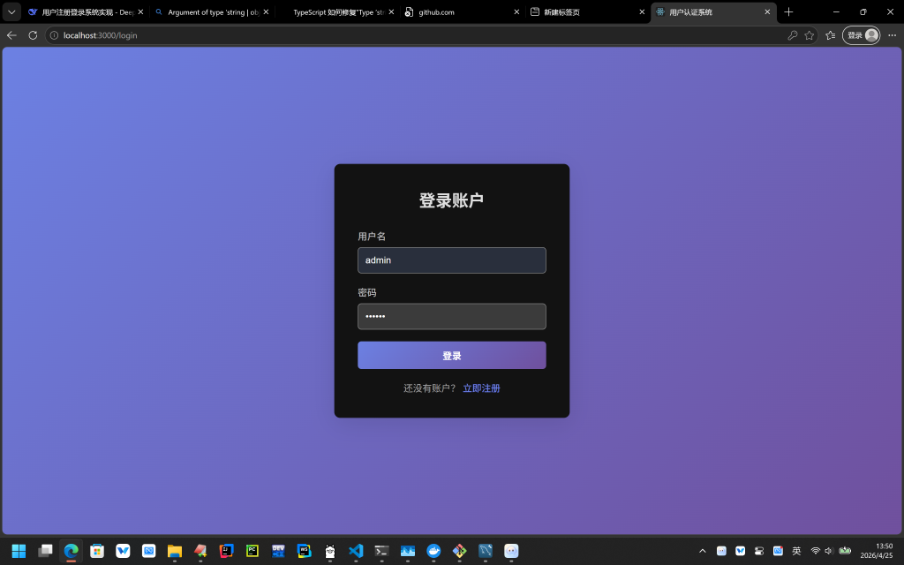
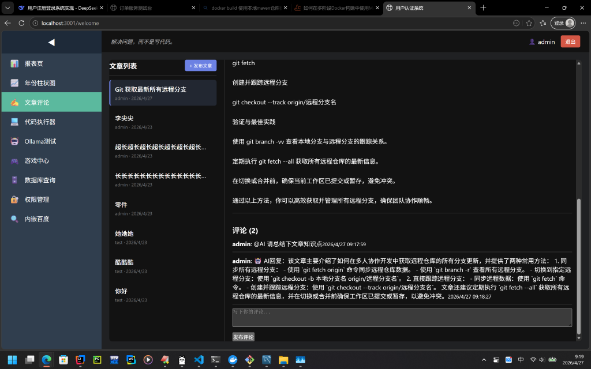
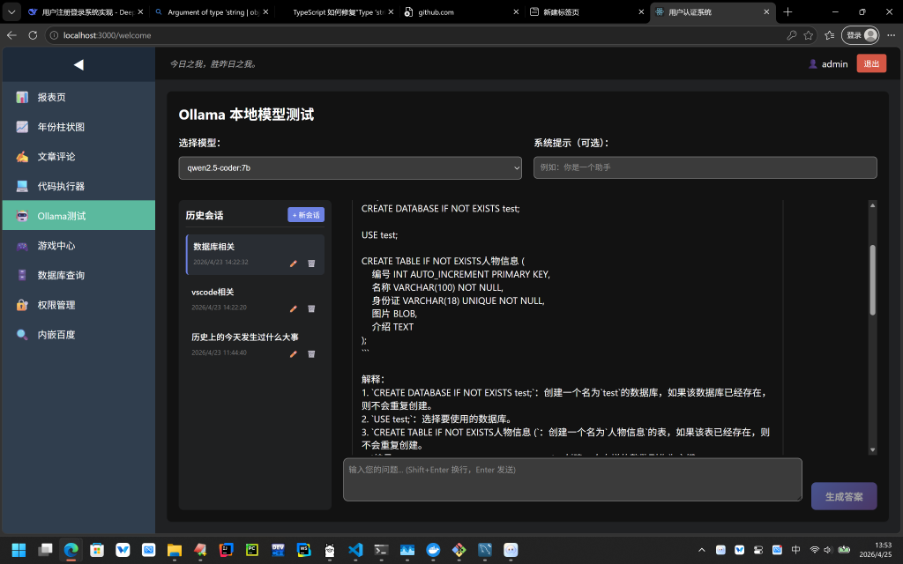
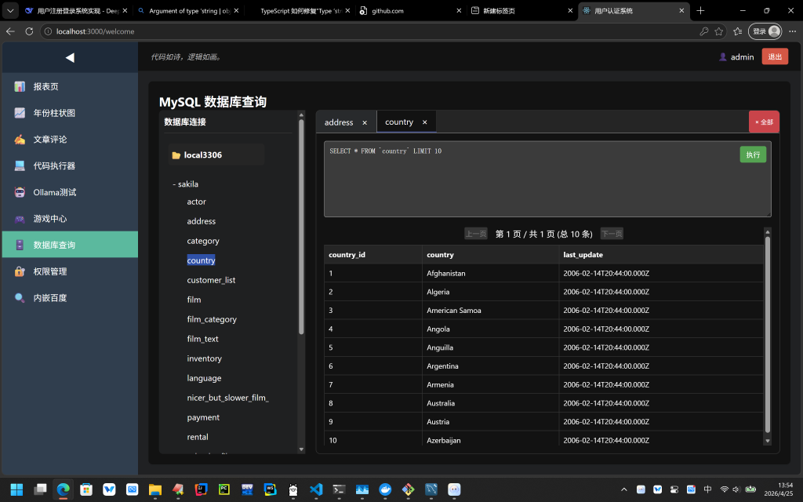

# 用户认证系统 (Node.js + React)

## 功能特性
- 用户注册/登录（JWT 认证）
- 可折叠侧边栏菜单
- 顶部常驻栏：定时更换的美文警句 + 用户状态/退出按钮
- 八个功能页面：
  1. 报表页（系统统计）
  2. 年份柱状图（recharts 实现）
  3. 带评论功能的文章发布（支持评论增删）
  4. 页面代码执行器（HTML/CSS/JS 在线运行）
  5. Ollama 本地模型测试（需本地运行 Ollama，含多序列对话管理）
  6. 网页游戏
  7. 用户的MySQL表授权管理
  8. MySQL数据查询

## prompts
  设计一个node react框架的网站， 实现用户注册和登录页面，登录成功后自动跳转到欢迎界面，欢迎界面左端可折叠的结构，上方常驻栏（左侧有定时变动的美文警句，左侧是用户登录状态和退出按键），左端添加至少5个tab页，分别是报表页，年份柱状图，带评论功能的文章发布，页面代码执行器，本地ollama可选择模型的测试页面，全部代码给我提供一个自动构建脚本


  Ollama 本地模型测试 页面修改如下：
  1. 选择模型和系统提示 并排放
  2. 用户输入框放页面最下方，右侧放大号的生成答案按钮
  3. 用户输入和AI回答等历史会话内容放中间

  请给出增量的修改脚本代码


  年份销售数据柱状图 页面修改如下：
  1. 数据从后端获取
  2. 添加同比折线图
  3. 点击单项可隐藏
  请给出增量的修改脚本代码


  年份销售数据柱状图 中点击单项可隐藏功能不是直接数据项，而是在图表中隐藏，下面数据项只是变灰，变灰后点击又能在图表中显示，给出文件修改代码

  Ollama 本地模型测试 页面再次修改如下：
  1. 会话列表和历史会话内容保存后端文件中
  2. 进入页面加载历史会话到页面右侧
  3. 点击历史会话时将当前会话的历史问答内容展示在中间内容框
  4. 不点历史会话直接对话，则生成新会话，会话标题为第一次问答的简介
  请给出增量的修改脚本代码


  系统报表 页面数据中 注册用户和总评论数从后端真实数据统计，请给出增量的修改脚本代码

  文章评论 页面修改如下：
  1. 新增文章发表功能
  2. 左侧为文章列表，展示标题
  3. 点击文章标题后，右侧展示文章内容和相关评论
  4. 进入页面时默认展示最新文章

  左侧导航栏添加一个游戏页，游戏内容为一个火柴人在森林中打小动物，通过上下左右键可移动，A键可攻击，小动物死后掉东西，死后的小动物还会随机刷新

  左侧导航栏添加一个射击类游戏页，游戏内容一架飞机自动扫射从上而下的敌人，游戏点击启动后，上方不间断有敌军飞下来，本机能左右移动并自动开火，一开始只有一条子弹，破敌3个后逐渐增加，最多6条，1-3条都是平行向上，4-6条时逐渐变成60度的射击视角

  击毁敌机需要击中的次数与当前子弹数成正比，即1级子弹只要1次，6级子弹需要6次

  添加随机刷新20点血的boss功能

  Ollama 本地模型测试 历史会话支持删除和修改标题名称

  将 ✏️（编辑）和 🗑️（删除）按钮 放在会话标题下面时间的右侧，不单独起一行

  左侧导航栏添加一个数据库查询页Tab，页面填写mysql地址用户名密码等后生成数据库列表栏，双击列表后展开获取的对应库名，双击库名后展开获取的对应的表名，并在右侧开启对应的tab页，多次双击同库名不新增，对应tab页上半部分为sql代码编写框，下半部分为宽高自适应的返回数据的表格，返回数据分页，每页最多10条，点击下一页时实时查取，执行按键在右上

  将数据库查询页面上的输入折叠放置数据库列表上，并将同一地址的库归并到一个主机和端口名下，不同主机和端口名的数据区分开

  成功的数据库连接 保存到后端文件，再次进入页面时可以读取

  对数据库连接列表中的表名，从单击改成双击产生新的tab框，在tab上双击关闭当前tab框
  
  在Tab 栏的最右侧添加关闭全部按钮

  左侧导航栏添加一个数据库和表权限与用户关系Tab，右侧有当前系统人员名和可填写MySQL地址的可增加的数据库列表栏，双击左侧人员名可在右侧展示当前人员所属的库和表名称，各表可多人共属，人员和表关系可加可减，并记入后端文件

  权限管理页系统人员数据为空，需要从后端获取，另外MySQL地址应该在此此处可添加，双击后获取库和表结构信息，双击人员列表中人名和数据库列表中表名，可对表和人员绑定，新增到右侧展示栏，展示栏中关系数据双击后删除，整个展示栏下方有保存按钮，点击后能保存人员和表的关联数据

  用户表权限管理 中系统人员选择使用 choice 下拉列表框形式，减小网页占比，给数据库连接（可添加）多增加空间，已绑定权限 栏 只显示当前选择的用户所属库表权限

  系统人员div放数据库连接（可添加）上方，添加连接按钮 与 标签紧凑，给更多空间用于显示库表的结构信息，另外系统人员列表依旧数据显示为空，需要从后端获取当前用户数据，显示用户名，在记录用户和表的权限时记录用户id和库表id或名称，便于显示和后续过滤使用

  权限管理页中的库表关系操作按数据库查询页中数据库连接div方式处理，在这个div上方放置用户的选择框

  数据库查询页中数据库连接里面返回的数据使用权限管理页中绑定的用户和表数据进行过滤，不显示未授权的表

  将森林游戏和星际射手合并成一个左侧导航栏，两个页面分别作为单独Tab页放置在右侧画布

## 快速启动

### 后端
```bash
cd server
npm install
npm run dev   # 开发模式，默认 http://localhost:5000
```

### 前端
```bash
cd client
npm install
npm start     # 默认 http://localhost:3000
```

### 可选：Ollama 服务（如需使用测试页面）
1. 安装 Ollama: https://ollama.com/
2. 运行 `ollama serve`
3. 下载模型示例: `ollama pull llama2`

## 环境变量
- 后端：`server/.env` 可修改端口和 JWT 密钥
- 前端：`client/.env` 可修改 API 地址

## 更新列表
  - 2026/04/27  文章评论添加@AI功能

##  效果图：






# 🎭 AI 角色对话工坊

一个基于 **Ollama** 本地模型的交互式应用，可动态生成角色、设定场景，并让多个 AI 角色自动展开对话。支持用户随时插话，适合创意写作、游戏 NPC 对话模拟等场景。

## ✨ 核心功能

- **动态生成角色**：输入 N（2~6），AI 自动生成姓名、年龄、职业、性格、生活习惯。
- **智能生成场景**：根据角色设定，自动生成一个有讨论价值的现实生活场景。
- **多角色自动对话**：角色按顺序自动发言，AI 严格依据角色设定进行回复。
- **手动插话**：用户可以以自己或任意角色身份插入一句话，AI 会立即回应并继续对话。
- **完全本地运行**：依赖 Ollama 本地模型，无需 API Key，数据隐私安全。